# Rapport TP1
## Groupe de travail
|          Nom          | Matricule  |   CIP    |
|:---------------------:|:----------:|:--------:|
|   Alexandre Theisse   | 23 488 180 | thea1804 |
| Louis-Vincent Capelli | 23 211 533 | capl1101 |
|      Tom Sartori      | 23 222 497 | sart0701 |
## Introduction

Ce premier TP porte sur la séparation des différentes classes de cancer à partir de leurs données génomiques. En effet, nous avons étudié différents types de tumeurs telles que BRCA, KIRC, COAC, LUAD et PRAD. Le but de ce TP est de découvrir différentes méthodes pour déterminer si les différentes tumeurs sont bien séparées.

## Méthode 1 (sans visualisation des données)

Dans cette partie, on étudiera une méthode pour confirmer la séparation des variables sans visualisation des données, grâce à un indicateur de superposition des classes défini à partir des distances intra-classe et inter-classe.

### Distance intra-classe

Cette distance est la distance maximale entre un échantillon quelconque d'une classe et le centre de cette classe. Cette mesure peut aussi nous servir d'indicateur sur la dispersion de la classe. En effet, plus la distance intra-classe est grande, plus les données d'une même classe seront dispersées.

### Distance inter-classe

La distance inter-classe (par exemple entre les classes "BRCA" et "KIRC") est définie comme étant la distance minimale entre un objet quelconque de la classe "BRCA" ou "KIRC" et le centre de la classe "BRCA" ou "KIRC". Cette distance est un indicateur de la séparation des classes. En effet, plus la distance inter-classe est grande, plus les classes sont séparées.

### Overlap

Enfin, pour tester que les différentes classes sont bien séparées, nous calculons l'overlap, un indicateur de test pour confirmer la séparation des classes. L'overlap peut se définir comme le rapport entre la somme des distances intra-classes des deux classes sélectionnées et deux fois la distance inter-classe entre les deux classes. Ainsi, pour confirmer que les classes sont séparées, le rapport de l'overlap doit être logiquement inférieur à 1, ce que l'on pourrait interpréter comme le fait que les individus de la même classe sont plus rapprochés entre eux qu'avec les individus de l'autre classe.

### Explication des métriques utilisées

Pour calculer ces indicateurs, nous avons utilisé différentes trois distances différentes afin d'en comparer les résultats. Ces distances sont la distance euclidienne, la distance cosinus et la distance de Mahalanobis.

### Méthode d'implémentation

Pour coder ces différentes méthodes, nous avons d'abord extrait les données des fichiers *labels.csv* et *data.csv* grâce à la librairie pandas. Ces données sont ensuite stockées dans des matrices.

Ensuite, la prochaine étape est de calculer la moyenne des gènes pour les différentes classes de tumeurs que nous stockerons dans une autre matrice de taille n*m avec n=5, nombre de classe de tumeur et m étant égal au nombre de gènes.

Une étape de plus est à faire pour la distance Mahalanobis puisqu'il faut calculer la matrice de covariance. De plus, celle-ci doit être inversible pour pouvoir être utilisée dans la formule. Nous avons décidé de la remplacer par une matrice pseudo-inverse grâce à la fonction *pinv* de la librairie numpy. Le calcul de l'inverse de matrice de si grande taille peut prendre beaucoup de temps, cela ne nous a pas posé de problème mais une solution envisageable serait de n'utiliser qu'un sous ensemble de gènes (par exemple les gènes qui auraient le plus de poids dans les composantes principales générées par une ACP).

## Résultats

Tout d'abord, voici le tableau récapitulant les distances intra-classes des différentes tumeurs.

|  Class  |  Euclidean intra-class distance  |  Cosine intra-class distance  | Mahalanobis intra-class distance |
|:-------:|:--------------------------------:|:-----------------------------:|:--------------------------------:|
|  PRAD   |            239.573589            |           0.024669            |             4.127821             |
|  LUAD   |            258.417752            |           0.028665            |             7.776645             |
|  BRCA   |            256.958613            |           0.028873            |             4.345722             |
|  KIRC   |            270.133555            |           0.030072            |             4.294693             |
|  COAD   |            255.525361            |           0.024443            |             3.962462             |

Voici les résultats pour les distances inter-classes entre chaque paire de classes.

|  Class A  |  Class B  |  Euclidean inter-class distance  |  Cosine inter-class distance  |
|:---------:|:---------:|:--------------------------------:|:-----------------------------:|
|   LUAD    |   PRAD    |            186.998355            |           0.014197            |
|   BRCA    |   PRAD    |            177.901233            |           0.012691            |
|   BRCA    |   LUAD    |            167.302799            |           0.011340            |
|   BRCA    |   KIRC    |            215.223269            |           0.019060            |
|   BRCA    |   COAD    |            197.588592            |           0.015987            |
|   KIRC    |   PRAD    |            226.669290            |           0.020985            |
|   KIRC    |   LUAD    |            200.050653            |           0.016165            |
|   COAD    |   PRAD    |            218.541389            |           0.019673            |
|   COAD    |   LUAD    |            181.115552            |           0.013887            |
|   COAD    |   KIRC    |            222.970291            |           0.020486            |

On peut constater que les distances inter-classes sont inférieures aux distances intra-classes. Ceci montre que les différentes classes sont assez proches les unes des autres et laisse présager que certaines ne seront pas bien séparées.

Enfin, voici les résultats des tests d'overlap entre chaque paire de classes.

|  Class A  |  Class B  |  Euclidean overlap  |  Cosine overlap  | Mahalanobis overlap |
|:---------:|:---------:|:-------------------:|:----------------:|:-------------------:|
|   LUAD    |   PRAD    |      1.331539       |     1.878395     |      0.982739       |
|   BRCA    |   PRAD    |      1.395528       |     2.109358     |      0.962372       |
|   BRCA    |   LUAD    |      1.540250       |     2.536962     |      0.968237       |
|   BRCA    |   KIRC    |      1.224524       |     1.546278     |      0.992783       |
|   BRCA    |   COAD    |      1.296846       |     1.667449     |      0.948273       |
|   KIRC    |   PRAD    |      1.124341       |     1.304295     |      0.882837       |
|   KIRC    |   LUAD    |      1.321044       |     1.816812     |      0.923733       |
|   COAD    |   PRAD    |      1.132735       |     1.248203     |      0.953954       |
|   COAD    |   LUAD    |      1.418827       |     1.912094     |      0.923643       |
|   COAD    |   KIRC    |      1.178764       |     1.330545     |      0.997632       |

On s'aperçoit que les overlaps sont supérieurs à 1 dans le cas des distances euclidienne et cosinus. Ainsi, les différentes classes de tumeurs ne sont pas suffisament séparées avec ce jeu de données. La distance Mahalanobis montre de meilleurs résulats : toutes les classes peuvent être considérées comme séparées. Pour améliorer la séparation, une des pistes serait de sélectionner les gènes les plus pertinents pour la séparation des classes. Pour cela, on pourrait utiliser une ACP comme présenté dans la partie suivante.

## Méthode 2 (avec visualisation des données)
Nous avons choisi d'étudier les variables "gene_3" et "gene_4", qui ont une distribution assez similaire aux autres et ne possèdent pas trop de 0 contrairement à "gene_0" par exemple.

### Distribution des différentes classes (1D)
Nous avons donc créé 5 histogrammes pour chacune de ces variables, en affichant dans chaque histogramme les données correspondant à la classe correspondante. 

Le code utilisé pour générer ces histogrammes récupère les classes distinctes depuis le fichier *labels.csv* afin qu'il fonctionne peu importe le nombre de classes présentes dans le fichier.

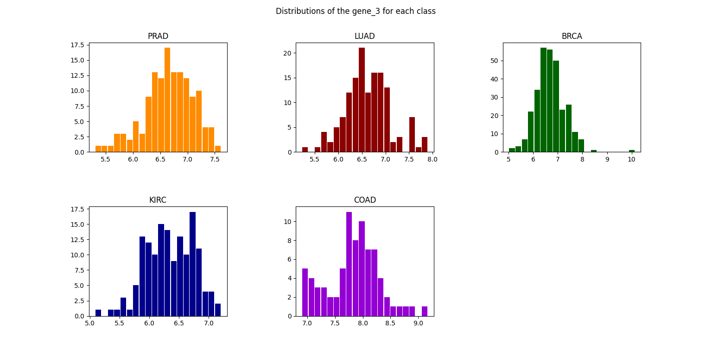
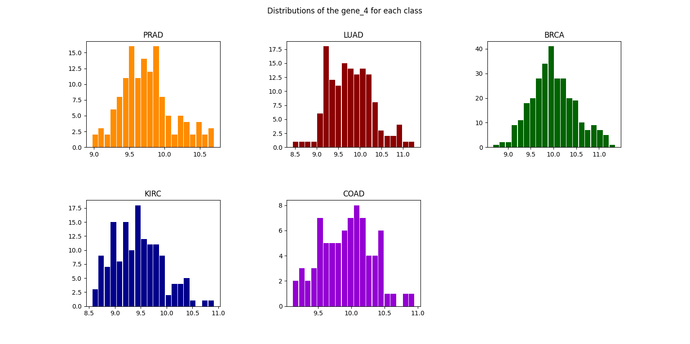

On constate que l'allure des histogrammes est assez similaire pour les deux variables, avec une distribution qui semble gaussienne.

### Distribution des différentes classes (2D)
Nous avons donc créé 1 graphique en nuage de points qui permet d'afficher les valeurs de ces deux variables pour chacune des 5 classes.

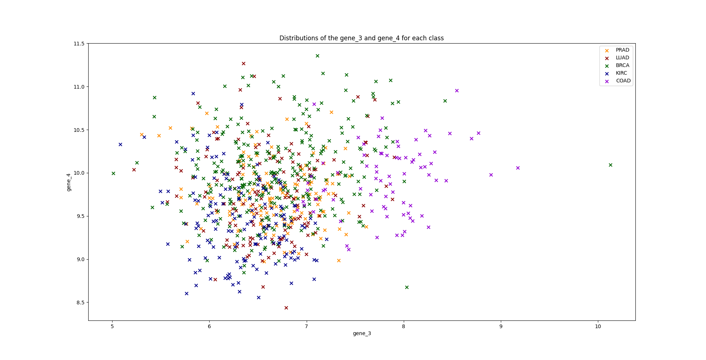

Le graphique est assez difficile à interpréter du fait du manque de lisibilité. En effet, hormis la classe "COAD" qui semble est assez bien séparée des autres, les autres classes se superposent beaucoup trop pour pouvoir être distinguées.

On observe ce genre de graphiques pour la plupart des paires de variables que nous avons testées, ce qui appuie l'intérêt de méthode comme l'ACP, t-SNE ou UMAP qui permettent de réduire la dimensionnalité des données afin de mettre en évidence des tendances qui ne sont pas visibles en choisissant deux variables au hasard.

### Distribution des paires de classes (1D)
Parmi les 10 paires de classes possibles, nous avons choisi d'étudier les paires suivantes :
- "BRCA" et "COAD"
- "KIRC" et "COAD"
- "BRCA" et "KIRC"

En effet, ces paires de classes sont celles qui sont les plus facilement distinguables sur le graphique en nuage de points précédent et nous permettront donc de mieux visualiser les différences entre les classes.

Nous avons donc créé 1 histogramme pour chacune de ces 3 paires de classes, en affichant dans chaque histogramme les données correspondant aux 2 classes correspondantes et ce pour chacune des 2 variables. (Pour des raisons de lisibilité, nous avons choisi de ne joindre au rapport que les histogrammes pour la variable "gene_3")

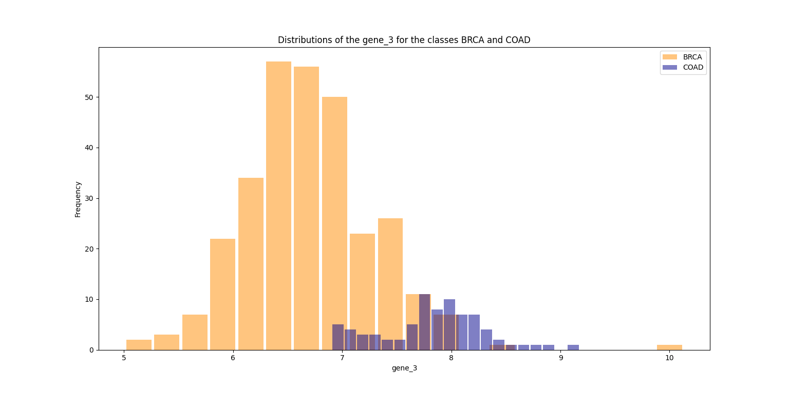
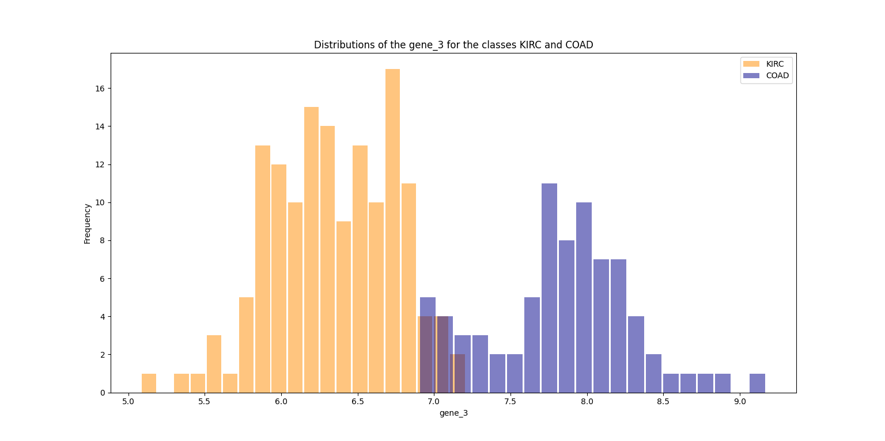
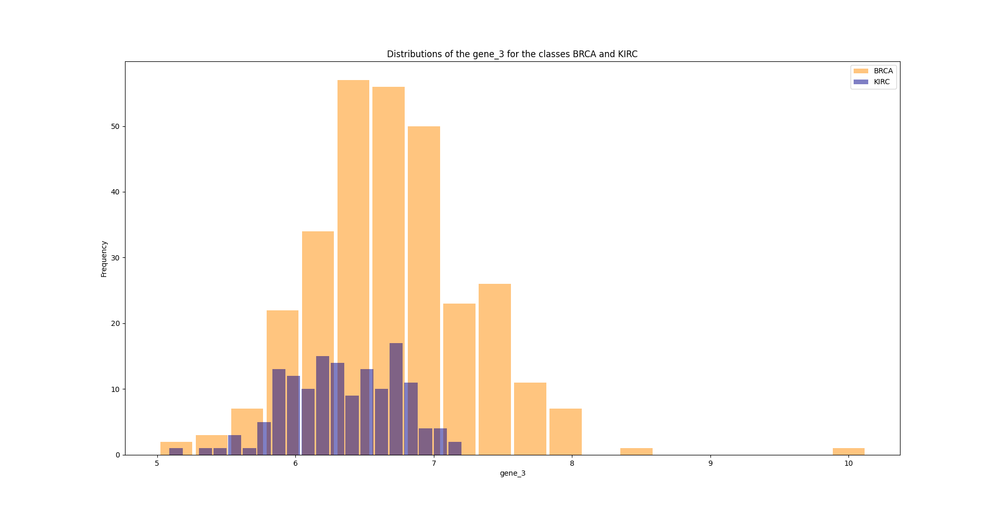

On remarque en effet que les classes sont bien séparées sur les 2 premiers histogrammes, ce qui confirme l'intérêt de la méthode avec visualisation des données. 

Également on constate que la classe "BRCA" est sur-représentée par rapport aux autres classes ce qui peut avoir des implications lors d'analyses statistiques ou d'entrainement de modèles de machine learning.

### Distribution des paires de classes (2D)
De la même manière que pour les histogrammes, nous avons créé des graphiques en nuage de points qui permettent d'afficher les valeurs de ces deux variables pour chacune des 3 paires de classes mentionnées précédemment (BRCA/COAD, KIRC/COAD et BRCA/KIRC).

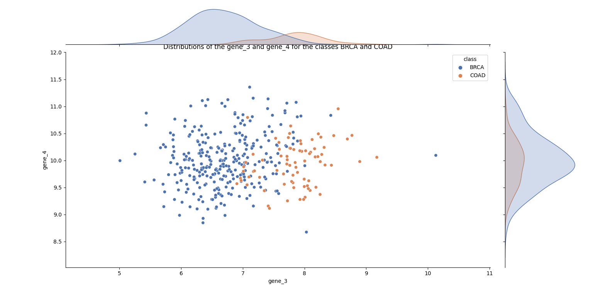
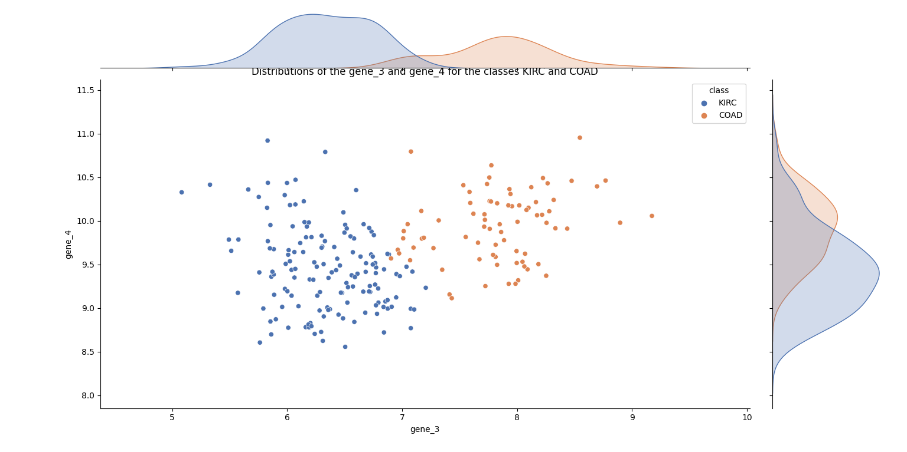
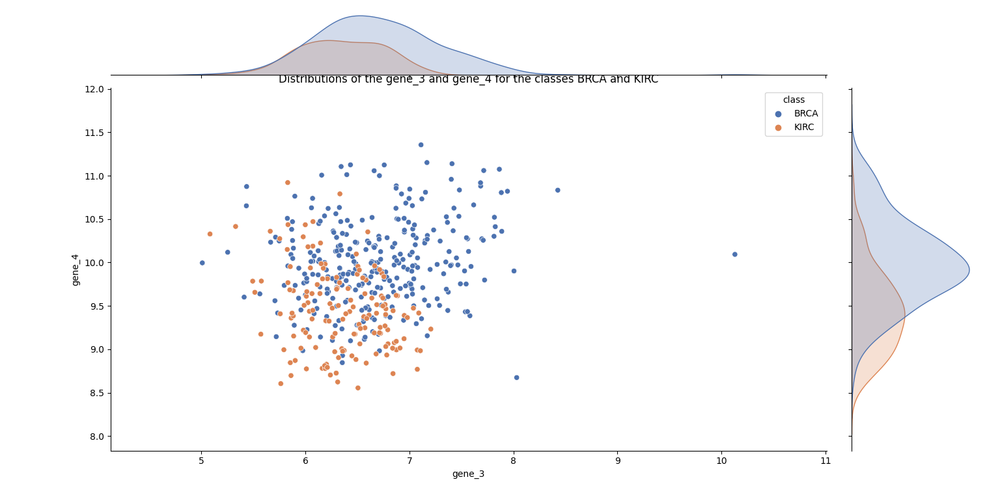

Ces graphiques ne présentent aucune information supplémentaire par rapport au nuage de points contenant toutes les classes. Ils ont en revanche l'avantage d'être plus lisibles et donc plus facilement interprétables.

On retrouve sur les bords des *jointplot* (et notamment au-dessus pour la variable "gene_3") les tendances illustrées par les histogrammes des classes correspondantes, joints dans la partie précédente. 

### Distribution des données après transformation

#### ACP
L'ACP permet de réduire la dimensionnalité des données en les projetant sur un espace de dimension inférieure. Dans notre cas, nous avons choisi de projeter les données sur un espace de dimension 2 afin de pouvoir les afficher sur un graphique en nuage de points.

L'algorithme utilisé pour l'ACP est celui de la librairie *scikit-learn*.

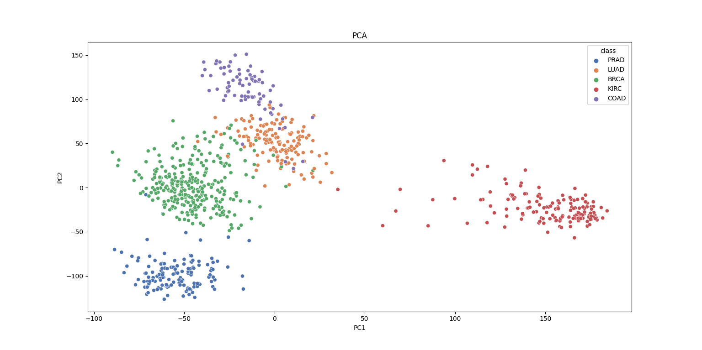

Le fait de condenser les informations contenues dans l'ensemble des variables en 2 dimensions permet de mettre en évidence des tendances qui ne sont pas visibles en choisissant deux variables au hasard.

Les résultats montrent des classes qui sont mieux séparées que sur les graphiques en nuage de points précédents. On constate notamment que une classe "KIRC" bien distincte. 

#### t-SNE
De la même manière, nous avons utilisé l'algorithme de t-SNE de la librairie *scikit-learn* afin de projeter les données sur un espace de dimension 2.

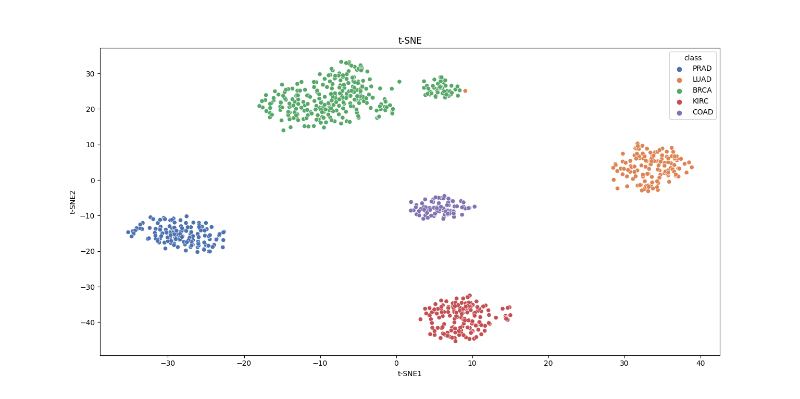

Cette fois-ci, les classes sont encore mieux séparées que sur le graphique de l'ACP avec un seul outlier pour la classe "LUAD".

#### UMA
Le dernier algorithme que nous avons utilisé est celui de UMAP, issu de la librairie *umap-learn*.

Les données sont projetées sur un espace de dimension 2.

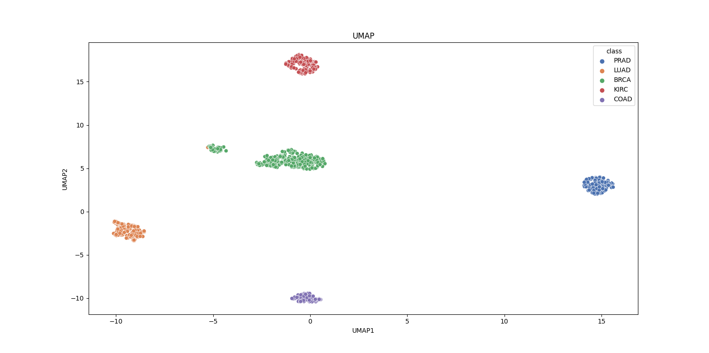 

Les résultats sont similaires à ceux de t-SNE avec une meilleure séparation des classes malgré à nouveau au moins un outlier pour la classe "LUAD".

## Sources et références
- [Matplotlib : figure_api](https://matplotlib.org/stable/api/figure_api.html)
- [Matplotlib : pyplot hist](https://matplotlib.org/stable/api/_as_gen/matplotlib.pyplot.hist.html)
- [Matplotlib: pyplot subplots](https://matplotlib.org/stable/api/_as_gen/matplotlib.pyplot.subplots.html)
- [Matplotlib : pyplot subplots_adjust](https://matplotlib.org/stable/api/_as_gen/matplotlib.pyplot.subplots_adjust.html)
- [Numpy](https://numpy.org/doc/stable)
- [Pandas](https://pandas.pydata.org/docs)
- [Scipy](https://docs.scipy.org/doc/scipy)
- [Scikit learn](https://scikit-learn.org/0.21/documentation.html)
- [Seaborn pydata](https://seaborn.pydata.org/generated/seaborn.jointplot.html)
- [Stackoverflow : how-can-i-make-a-blank-subplot-in-matplotlib](https://stackoverflow.com/questions/10035446/how-can-i-make-a-blank-subplot-in-matplotlib)
- [Umap learn : basic usage](https://umap-learn.readthedocs.io/en/latest/basic_usage.html)
- [Umap learn : doc](https://umap-learn.readthedocs.io/en/latest)
- [Tabulate : toMarkdown()](https://pandas.pydata.org/docs/reference/api/pandas.DataFrame.to_markdown.html)
